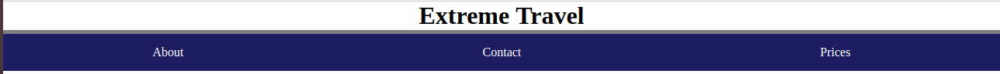

# Extreme Travel Website!

**Aufgabe**: 
* Wähle den `header` aus, der der ersten `h1` am nächsten ist. Gib dem `header` einen 5px border.

* Wenn die `.info`-section ein `.info-package`-Element enthält, sollen alle `package-title`-Elemente ausgewählt werden und die Elemente, die jeweils vor dem title kommen, einen border bekommen.
 

* Prüf, ob label die Klasse "mild" hat. Wenn ja, füge beim label einen gelben border hinzu. Wenn label die Klasse "intense" hat, soll es einen orangen border bekommen. Wenn es auch diese Klasse nicht gibt, soll das label einen roten border bekommen.
 

* Füg alle Kinder von `.nav-list` in die ul im footer `.site-map` ein. Die `.nav-list` solle weiterhin ihre Kinder behalten 